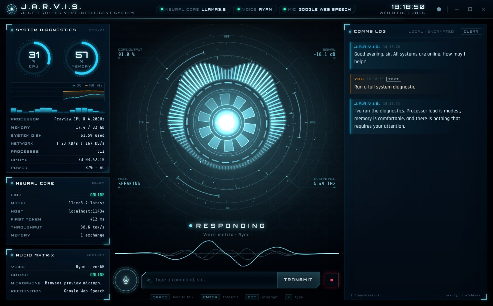

# J.A.R.V.I.S. — local desktop voice assistant

A holographic, Iron-Man-style desktop assistant that talks back. It runs with **no paid API keys**:

| Part | Engine | Cost / key |
|---|---|---|
| Brain | [Ollama](https://ollama.com) running `llama3.2` (or any local model) | free, runs offline on your PC |
| Voice | Microsoft Edge neural TTS via `edge-tts` — `en-GB-RyanNeural` by default | free, no key (needs internet) |
| Ears | Google Web Speech via `SpeechRecognition` — or **offline** Whisper / Vosk | free, no key |
| HUD | `pywebview` + HTML5 Canvas / SVG / CSS | — |




## Features

- **Arc-reactor core** on Canvas: rotating tick rings, coils, a 96-bar circular spectrum, shock-wave rings on voice peaks, particles and live HUD read-outs. Colour follows the speech state machine **IDLE → LISTENING → THINKING → SPEAKING** (cyan, aqua, amber, ice blue).
- **Audio-reactive visualisers**: real FFT bands from the microphone while listening and from JARVIS's own voice while speaking (each clip is analysed once in Python and played back in sync in the UI), plus an oscilloscope waveform.
- **Streaming replies**: tokens stream into the comms log with a typewriter effect, and JARVIS starts speaking after the first sentence instead of waiting for the full answer.
- **Push-to-talk + silence detection**: click the mic (or tap <kbd>Space</kbd>) and just talk — capture stops on silence. Hold the button/<kbd>Space</kbd> for classic push-to-talk. Press it while JARVIS is talking to barge in; <kbd>Esc</kbd> interrupts.
- **Opens your files, apps and games**: "open my resume", "open Spotify", "open calculator", "open settings", "open the budget spreadsheet", "play GTA 5", "launch FIFA 26". JARVIS searches your Desktop, Documents, Downloads, Pictures, Music, Videos, OneDrive, every app in the Start menu (including Microsoft Store apps) and your installed games — **Steam** and **Epic** libraries plus anything registered with Windows (EA app, Ubisoft, Battle.net, GOG…). It understands nicknames: *GTA V / gta five* → Grand Theft Auto V, *RDR2*, *CS2*, *COD*, and *FIFA 26* → EA SPORTS FC 26 (FIFA's new name). It also finds programs through their install folders and Windows' App Paths, game shortcuts on your desktop, and dozens of Windows tools ("open device manager", "open windows update", "open command prompt"). It can read text and Word documents to summarise them. For safety it never runs programs you name by path; apps and games open through their shortcuts or launchers.
- **Internet access, free and key-less**: web search (DuckDuckGo, with a Wikipedia fallback), reading web pages and opening sites in your browser. Ask about news, weather, prices or anything recent. Both abilities can be switched off in Settings ▸ Abilities.
- **Writes for you, straight into Google Docs & Slides**: "write a bio on Lionel Messi", "write a 500-word report on electric cars", "make a presentation about the solar system". JARVIS looks the topic up (Wikipedia + the web), writes it with proper headings, lists and bold text, creates the Google Doc or Slides deck and opens it. Follow-ups work too: "add a section about his childhood to it", "make it shorter", "translate it into Spanish", "add a slide about Mars to my Solar System presentation".
- **Google Docs, Slides & Sheets editing**: "add a slide about pricing to my Pitch deck", "delete slide 3", "move the last slide to the front", "make a Google Sheet called Budget with rent 1200 and food 300", "what's in my Budget sheet?".
- **Opens your Google files by name**: "open my Messi doc", "open the budget spreadsheet", "open my latest presentation", "open it" (the one just made), "what docs do I have?". Links open as your linked Google account (so they don't land on the wrong-account or login page), in the browser you choose in Settings ▸ Google ▸ *Open links in*. If your browser asks you to sign in, say **"show it here"** (or press **VIEW** on the file card): JARVIS reads the file from your Google account and shows it in its own reader window, no browser and no sign-in needed. "Read my Messi doc to me" reads it aloud.
- **Email**: "email Sarah saying I'll be ten minutes late", "send my boss an email asking for Friday off", "email it to Tom" (shares the doc JARVIS just wrote). JARVIS writes the email, finds the address from your Gmail history, shows the draft in an editable card and asks "Shall I send it?". **Nothing is sent until you say yes or press Send.** Without the Google link, the draft opens in Gmail for you to send.
- **Patient, not pushy**: when you pause, JARVIS quietly checks what it heard. A finished sentence is answered right away; if you trail off ("open the…", "email John and…", "um…") it says "take your time" and keeps listening (Settings ▸ Voice input ▸ *Patience*, up to 8 extra seconds), and whatever you add simply continues the same request. Long dictation (up to 45 s) and a 10 s head start before you begin speaking are allowed.
- **Instant answers, no waiting for the model**: greetings and thanks, arithmetic ("what's 15 percent of 240", "twenty five times four"), battery / CPU / memory / disk status, volume and mute ("volume up", "set the volume to 40"), timers and reminders ("set a timer for 5 minutes", "remind me in 10 minutes to call Mum", "how long is left?"), screenshots, "show desktop", "lock the computer", coin flips, dice and jokes. They work even when Ollama is off. Chained requests ("open Spotify and then open Notepad") run in order, and the voice starts at the first comma of a long answer instead of waiting for the full stop.
- **Sees your screen, watches it, and can act on it** (all local and free):
  - **Look**: "what's on my screen?", "what does this error mean?", "summarise this article", "translate this page", "is this website safe?" or press the eye button. JARVIS captures the app you're working in (even when its own HUD covers it), reads its text with Windows' built-in OCR and asks a local vision model running on your GPU through Ollama. Say **"install vision"** (or Settings ▸ Vision ▸ Download) once to get Qwen2.5-VL (~6 GB). Without it, JARVIS still answers from the text it reads.
  - **Watch**: "tell me when my download finishes", "let me know if an error appears", "watch my screen" (speaks up about errors, finished tasks, new messages). An amber WATCHING strip with a STOP button shows whenever it's watching; "stop watching" ends it.
  - **Act**: "click Sign in", "press the blue Send button", "type cats into the search box", "press enter", "scroll down", "go back", "refresh", "close this tab". Exact on-screen text is clicked at once; anything uncertain, and anything risky (send, delete, buy, pay, close…), shows you a picture of exactly where it will click and waits for "yes". It never touches windows on your privacy list (password managers, banking…) and never types into password or payment fields. Switch it off in Settings ▸ Vision.
  - Screenshots go only to your local Ollama and are never saved. The capture → OCR → find → click → type pipeline is tested on a real Windows desktop in CI on every build.
- **Four personalities, one memory of you**: pick who you talk to from the face button in the title bar (<kbd>Ctrl</kbd>+<kbd>P</kbd>), Settings ▸ Personality, or just say "switch to Harper" / "let me talk to Jarvis".
  - **J.A.R.V.I.S.**: the impeccable butler. Calm, precise, dry British wit, calls you "sir" (or whatever you choose).
  - **Harper**: an exceptionally kind, friendly and informative companion. Warm and conversational, explains things clearly with examples, asks about your day, cheers your wins, is gentle when things are hard, and brings up what she remembers about you. Calls you by your name.
  - **F.R.I.D.A.Y.**: quick, upbeat and a little cheeky, with an Irish voice. Calls you "boss".
  - **Sage**: a patient mentor who explains step by step and checks you've understood.
  Each has its own character, voice (with matching voices in other languages), small talk and HUD colours (Harper brings a warm Rose theme); all share the same skills and memory. Press **HEAR** in the picker to listen before switching.
  - **Create your own**: press **+ Create your own** and give it a name, describe its personality in your own words ("a cheerful pirate who loves puns"), pick any voice (with a HEAR preview) and a colour. Edit or delete it any time; say "switch to Nova" like any other.
  - **Your colours**: every personality has a colour button. Pick any colour and the whole HUD (reactor, gauges, glow) takes it on whenever that personality is active. Settings ▸ Interface ▸ *Custom colour…* does the same.
- **Each personality answers to its own name**: "Hey Harper" (or just "Harper") wakes Harper, "Hey Sage" wakes Sage, "Hey Nova" wakes the one you made. There's no ready-made model for those names, so JARVIS **teaches itself**: it has dozens of Microsoft neural voices say the name in different accents, speeds and rooms, and trains a small listener on top of the same offline speech features "Hey Jarvis" uses (about a minute, in the background, the first time you switch; it needs the internet only for that). It checks itself on voices it never trained on before going live. For the best accuracy press **Teach my voice** on the card and say the name 3-5 times. "Hey Jarvis" keeps working with every personality unless you turn that off (Settings ▸ Voice input).
- **Long-term memory that stays on your PC**: JARVIS remembers who you are across restarts.
  - **Facts, preferences, routines and projects**: "remember that my sister is called Ana", "I'm allergic to peanuts", "I go to yoga every Tuesday at 6 pm", "I'm building a website for my mum's bakery". It also picks these up from normal conversation by itself (a small background step with your local model that only runs when what you said sounds personal, and never stores passwords, codes or card numbers). A **REMEMBERED** note with **UNDO** appears in the log each time.
  - **Uses it naturally**: relevant memories go into every answer ("recommend some music" → it knows you love jazz), today's routines are mentioned when it starts up, and finished projects are ticked off ("I finished the bakery website").
  - **Ask about it**: "what do you know about me?", "do you remember my dog's name?", "what am I working on?", "what's my routine today?", "what did we talk about last time?", "call me Tony", "what's my name?".
  - **Conversations carry on**: chats are summarised into short diary entries, and if you restart within 3 hours JARVIS picks up exactly where you left off.
  - **Memory Core** (brain button, <kbd>Ctrl</kbd>+<kbd>M</kbd>): browse by kind, search, edit, pin (always keep in mind), mark projects done, delete with undo, add your own, export to JSON, or erase everything. "Forget that I like tea" and "forget everything" (asks first) work by voice too.
  - Recall blends keyword ranking with meaning-based search when the free `nomic-embed-text` model is installed (one click in the Memory Core). Everything lives in `memory.db` in `%APPDATA%\JARVIS`; switch any part off in Settings ▸ Memory.
- **HUD colour schemes**: Arc reactor cyan, Mark III red & gold, Stealth green, Violet or Rose (Settings ▸ Interface).
- **Speaks your language**: talk or type in Spanish, French, German, Italian, Portuguese, Japanese, Chinese, Arabic and 20+ more; JARVIS detects it, answers in it and switches to a native voice. Speech recognition listens for your main language and the others you speak at the same time (Settings ▸ Voice input).
- All Google features work through a tiny script that runs in *your own* Google account (free, no API key): Settings ▸ Google ▸ Set up walks you through the 3-minute, one-time link. The script is `integrations/jarvis_google_bridge.gs`. If you linked an older version, JARVIS tells you and Settings ▸ Google ▸ **Update script** walks you through the one-minute update (your link stays the same).
- **"Hey Jarvis" wake word**: offline and free. Say "Hey Jarvis" and your request in one breath ("Hey Jarvis, what time is it?") or pause after the wake word; JARVIS stops listening by itself when you finish speaking. Say "Hey Jarvis, stop" while it is talking to silence it. This pipeline is tested on recorded speech: wake word → end-of-speech detection → reply → "stop".
- **Text input** for silent typing, with Markdown/code rendering in the log.
- **Telemetry**: CPU and RAM gauges, 60 s history, per-core bars, disk, network, processes, uptime, battery.
- **Interface sounds** synthesised at start-up (activation chime, listening blips, processing ticks, error tones) — no audio files shipped.
- **Ollama guidance overlay**: if Ollama isn't reachable you get setup steps, a copyable `ollama run llama3.2`, a *Start Ollama* button when it's installed, and auto-retry. If Ollama runs but has no model, JARVIS can download `llama3.2` for you with a progress bar.
- **Settings drawer**: model, host, creativity, custom instructions, voice + preview, rate/pitch, recognition engine, language, end-of-speech pause, conversation mode (listen again after replying), sounds, form of address.

## Quick start (Windows)

1. Install **Ollama** from <https://ollama.com/download>, then in a terminal: `ollama run llama3.2`
2. Run `Jarvis.exe`.

That's it. Settings and logs live in `%APPDATA%\JARVIS\` (`config.json`, `jarvis.log`). If J.A.R.V.I.S. ever fails to start it shows an error dialog; the details are in `jarvis.log` (and `%TEMP%\jarvis-crash.txt`).
Because the exe isn't code-signed, Windows SmartScreen may show a warning on first launch: choose *More info → Run anyway*.
The UI needs the Microsoft Edge **WebView2** runtime, which ships with Windows 10/11.

## Run from source

```bash
python -m venv .venv
.venv\Scripts\activate            # Linux/macOS: source .venv/bin/activate
pip install -r requirements.txt
python app.py                      # --debug opens the web inspector
```

Linux needs PortAudio headers for PyAudio (`sudo apt install portaudio19-dev`) and a pywebview GUI backend (`pip install "pywebview[qt]"`).

Optional offline speech recognition: `pip install -r requirements-optional.txt` (faster-whisper and/or Vosk), then pick the engine in Settings — *Automatic* prefers Whisper, then Vosk, then Google.

## Build `Jarvis.exe`

On a Windows machine with Python 3.10–3.12:

```bat
pip install -r requirements.txt
python build.py
```

`build.py` checks dependencies, runs the unit tests, renders the icon, runs PyInstaller (`--onefile --windowed`, version resource, trimmed SpeechRecognition data) and then **launches the built exe with `--selftest`** to prove it starts. Output: `dist\Jarvis.exe`.

Options: `--install` (pip install first), `--onedir` (folder build, faster start-up), `--console` (keep a console for debugging), `--skip-tests`, `--no-selftest`.

PyInstaller only builds for the OS it runs on, so the Windows exe is also built by GitHub Actions (`.github/workflows/build.yml`) on every push: download it from the run's **Artifacts** (`Jarvis-windows-x64`). Pushing a `v*` tag attaches it to a GitHub release.

## Project layout

```
app.py              entry point, pywebview window, JS⇄Python bridge, --selftest
core/
  assistant.py      orchestrator: turns, interruption, speech pipeline
  state.py          IDLE / LISTENING / THINKING / SPEAKING state machine
  llm.py            Ollama client: detection, streaming chat, history, JSON tasks, embeddings, model pull
  personas.py       the personalities (built-in and your own): character prompts, voices, colours, "switch to Harper"
  wakelearn.py      teaching the wake-word listener a new name: synthetic voices, augmentation, a tiny numpy network
  wakewords.py      learned wake words: background training, recording your voice, models in %APPDATA%
  memory.py         long-term memory: SQLite store, hybrid recall, spoken commands, learning, episodes, resume
  tts.py            edge-tts on a background asyncio loop, sentence splitter, speech text cleanup
  stt.py            microphone capture with VAD + Google / Whisper / Vosk recognisers
  audio.py          pygame.mixer playback + FFT band analysis for the visualisers
  sfx.py            synthesised interface sounds
  system.py         psutil telemetry
  config.py         validated JSON settings in the user profile
  tools.py          files, apps & games discovery, web search, tool definitions for the model
  compose.py        long-form writing: "write a bio on ...", decks, follow-up edits
  mail.py           email requests, drafting and the confirm-before-send flow
  gdrive.py         "open / show / read my X doc": understanding requests about existing Google files
  browsers.py       opening links in the chosen browser, as the linked Google account
  patience.py       does the sentence sound finished? (decides whether to keep listening)
  quick.py          instant skills: small talk, sums, status, volume, timers (no model)
  osctl.py          volume, screenshots, show desktop, lock screen
  screen.py         window tracking, PrintWindow capture, SendInput mouse/keyboard (Win32 via ctypes)
  ocr.py            Windows built-in OCR through a persistent PowerShell helper (Tesseract fallback)
  vision.py         look / locate (text, numbered marks, grid) / watch / act on top of a local vision model
  language.py       offline language detection, voices and recognition languages
  wakeword.py       "Hey Jarvis" detection on onnxruntime + the shared microphone stream
  google_bridge.py  client for the user's own Apps Script (Docs, Slides, Sheets, Gmail)
integrations/       jarvis_google_bridge.gs, the script the user deploys in their Google account
web/
  index.html        HUD markup
  styles.css        holographic styling
  app.js            reactor/waveform renderers, chat, telemetry, overlays, push-to-talk
  devmock.js        simulated backend for previewing the HUD in a normal browser
  fonts/            Orbitron, Rajdhani, Share Tech Mono (SIL OFL), bundled for offline use
assets/             app icon + generator
hooks/              PyInstaller hook override
tests/              pytest suite + mock Ollama server
build.py            automated PyInstaller build
```

## Development

```bash
pip install -r requirements-dev.txt
python -m pytest -q                  # 550+ tests; no microphone, speakers or network needed
python -m tests.mock_ollama          # fake Ollama on :11434 for UI work without a model
```

Preview the HUD in a normal browser against a simulated backend: `python -m http.server -d web`, then open <http://localhost:8000/index.html?mock>; use `?ollama=offline` or `?ollama=nomodel` to see the setup overlays. (The simulated backend is never used inside the desktop app.)

## Privacy

Conversation text goes only to your local Ollama. Long-term memories and conversation summaries are stored only on your computer (`memory.db`) and can be viewed, edited, exported or erased in the Memory Core. Spoken replies are synthesised by Microsoft's Edge voice service, and the default recogniser sends your speech to Google; install faster-whisper or Vosk to keep speech recognition entirely on your machine.

## Credits

The "Hey Jarvis" wake-word models in `assets/wakeword/` come from [openWakeWord](https://github.com/dscripka/openWakeWord) (code Apache-2.0; pretrained models CC BY-NC-SA 4.0, so non-commercial use only).
